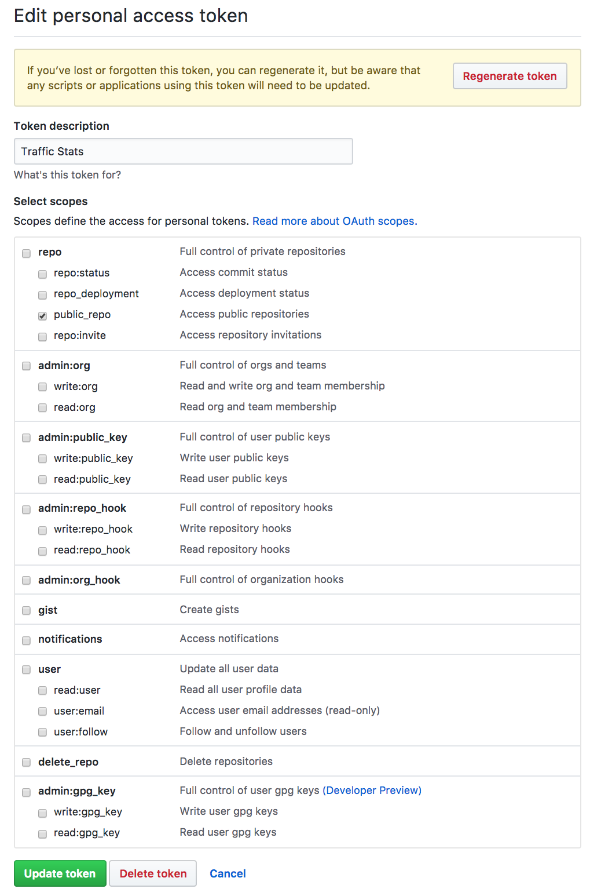

# github-traffic-stats-collector

WORK IN PROGRESS

## Architecture

### Diagram

```text
                          +---------------+
                          | +-----------+ |
                          | | Database  | | --------+
                          | +-----------+ | <-----+ |
                          |               |   GH  | | DB Processing
            Cron Trigger  |               | Stats | |    Trigger
+--------+ <------------- | +-----------+ | ------+ |
| GitHub |                | | OpenWhisk | | <-------+
+--------+ -------------> | +-----------+ | ------+
           Traffic Stats  |               |       |
                          |               |       | Update Dashboard
                          | +-----------+ |       |
                          | | Dashboard | | <-----+
                          | +-----------+ |
                          +---------------+
```

### Chronology

1. OpenWhisk cron trigger sends request for traffic statistics to GitHub
2. GitHub Returns traffic statistics
3. OpenWhisk sends GitHub Statistics to database
  * If database receives new statistics:
    1. Trigger OpenWhisk to process data
    2. Send newly processed data to dashboard
4. Dashboard displays reports

## Example

To use the [sample python script](example/gh_traffic.py), you will need to [create a personal access token](https://help.github.com/articles/creating-a-personal-access-token-for-the-command-line/) with public_repo access:


Then, run [`example/gh_traffic.py`](example/gh_traffic.py), entering your personal access token and repo path when asked:

```shell
$ $(which python) example/gh_traffic.py
GitHub personal access token: ****************************************
GitHub repo (username_or_orgname/reponame): IBM/github-traffic-stats-collector
...
# Data Snippeted for concisity
...
```

**NOTE:**

* Treat your personal access token like a password and keep it secure as such
* You will be able to pull traffic statistics for any repository you are not an admin of
  * If you are not an admin, you are not able to pull traffic statistics
